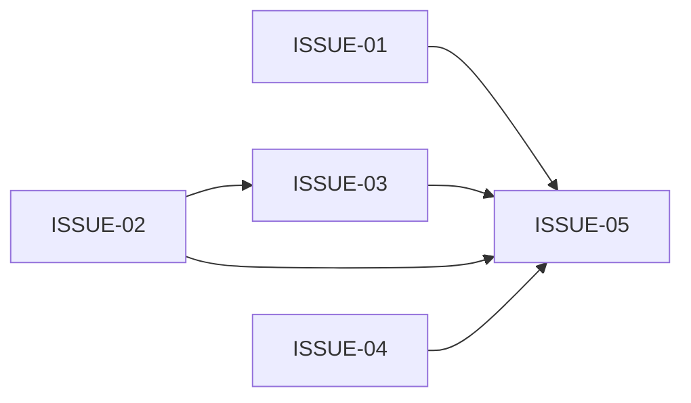

# V4.5 会话级入口 DAG 审计

状态：重写后待实现。

## 图形示意

## 审计结论

- ready：ISSUE-01、ISSUE-02、ISSUE-04；三者并行。
- ISSUE-03 仅硬依赖 ISSUE-02。
- ISSUE-05 硬依赖 ISSUE-01/02/03/04。
- `integration_after` 不阻塞独立 ready 节点。
- authorize 是物化计划、初始化运行状态和启动 Monitor 的单一入口。
- 远端 Git 是授权卡 allow/deny 选择，不是固定默认值。
