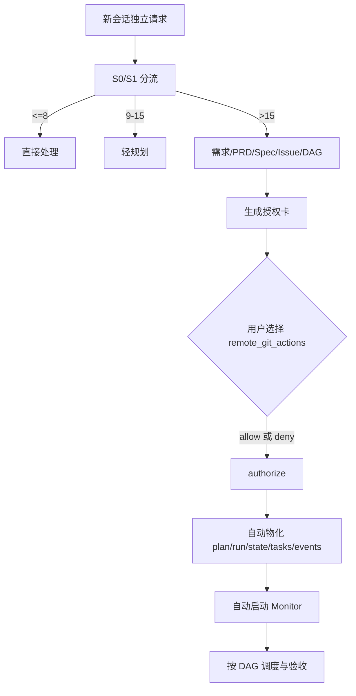
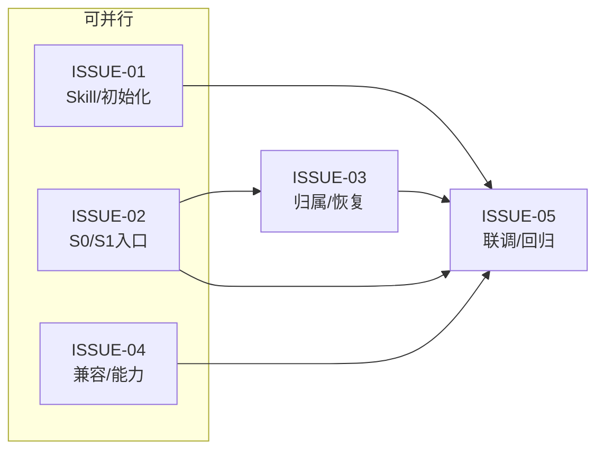

# V4.5 会话级 S0/S1 入口与授权即开工设计

状态：已确认（2026-09-15）。

## 目标

V4.5 将新会话的 S0/S1 分流、候选归属和受治理执行连接成一条用户可理解的路径。用户只参与产品决策和授权卡选择；系统自动生成、物化、校验和恢复工程状态。

## 已确认原则

- `authorize` 是唯一开工入口：用户指向授权卡并确认后，系统自动物化计划、初始化运行状态并启动 Monitor；不需要“启动监工”口令。
- 授权卡中的 `remote_git_actions` 是用户选择项，取值为 `allow` 或 `deny`，不是系统默认值。未选择前保持待授权；选择 `allow` 才允许 commit、push、创建 PR/MR、merge，选择 `deny` 则这些动作禁止。
- deploy、发布、生产写入、凭据和外部通信始终不在本卡授权内。
- plan、run、state、tasks、events、binding、lease、cursor 等工程字段由运行时自动生成或修复；缺失不能转化为用户填写项或二次启动门。
- DAG 必须同时提供机器可读关系和用户可读 Mermaid 图。

## 会话与授权流程

`authorize` 可在新会话中直接接收授权卡路径；运行时按卡片绑定的 plan、revision 和证据摘要恢复或创建同一运行，不要求先执行其他命令。重复 authorize 必须幂等，不创建第二 writer、第二 run 或第二 Monitor lease。

## DAG 可视化与语义

- `depends_on` 是硬依赖，未 accepted 不得启动后继。
- `integration_after` 只表示联调/收口关系，不阻塞独立 ready 节点。
- `parallel_group` 仅表达并行分组，不制造额外门禁。

## 工程状态机

`draft -> pending_user_authorization -> authorized -> running -> complete|blocked|failed`。其中 `authorized` 由用户完成授权卡选择后产生；进入 `authorized` 同一事务内自动物化运行时文件并尝试启动 Monitor。能力未知、provider 超时或绑定缺证据保持结构化内部状态（如 `blocked_unknown`、`retry_pending`），不要求用户输入内部字段。

## 兼容边界

保留 V4.2/V4.3/V4.4 的公开接口、状态值、历史读取、Intent/Proof 分离、非阻塞分类和唯一 writer 约束。V4.5 只改变入口投影和授权启动语义，不改写历史运行，不复制旧 `.vibe` 状态，不把测试或 README 当作外部能力证据。

## 验收

1. 新会话按 S0/S1 路由，复杂请求生成完整设计链和授权卡。
2. 授权卡展示 `allow/deny`，用户选择被审计；未选择不能进入 `authorized`。
3. `authorize <card-path>` 在新会话可直接执行，自动物化并启动 Monitor；重复调用幂等。
4. 不再出现 `start_monitor=false`、要求“启动监工”或“没有物化计划”这类用户阻断。
5. PRD、Spec、DAG 审计和计划均包含一致的 Mermaid 图和依赖语义。
6. deploy、发布、生产写入、凭据、外部通信始终排除。
