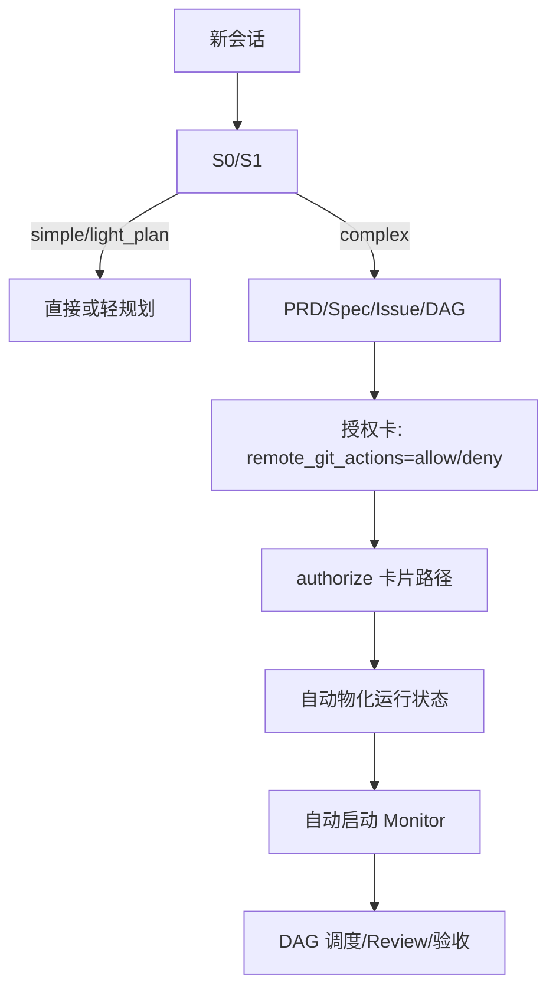
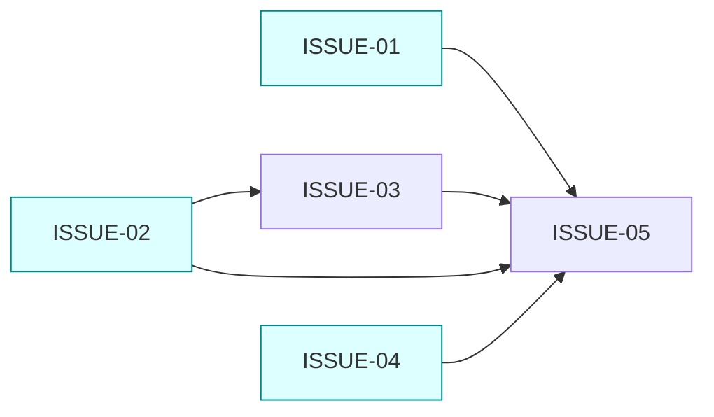

# V4.5 会话级 S0/S1 入口与授权即开工 PRD

状态：PRD 已确认（2026-09-15）；授权卡已按本版本重新生成，实施尚未授权。

## 1. 产品目标

让用户从 Agent 原生会话进入项目后，简单请求直接处理，复杂请求进入受治理 DAG。用户只做需求、产品决策和授权卡选择；系统负责工程状态生成、物化、绑定、调度、恢复和证据记录。

## 2. 产品决策

| 决策 | 结果 |
|---|---|
| 分流 | S0 明显简单；S1 <=8 直接，9-15 轻规划，>15 复杂编排 |
| 授权入口 | 指向授权卡执行 `authorize` 即自动物化并启动 Monitor，可从新会话执行 |
| 远端 Git | 授权卡展示 `allow/deny` 选项；用户选择后审计，未选择不得授权 |
| 工程字段 | plan/run/state/tasks/events/binding/lease/cursor 由系统生成或修复 |
| DAG 展示 | 机器关系 + Mermaid 图；并行、硬依赖、integration_after 分开表达 |
| 排除项 | deploy、发布、生产写入、凭据、外部通信永不由本卡授权 |

## 3. 用户路径

用户不需要输入 plan_id、node_spec、writer、worktree、lease、cursor、provider task 或启动命令。authorize 失败时显示系统状态和可恢复动作；不把内部字段升级为产品阻断。

## 4. DAG

`depends_on` 只控制启动；`integration_after` 不阻塞 ready；`parallel_group` 用于展示和并发调度。ready 节点 ISSUE-01、02、04 同时可启动。

## 5. 验收矩阵

| 编号 | 通过标准 |
|---|---|
| AC-01 | S0/S1 阈值和有效 S1 优先规则保持一致 |
| AC-02 | 授权卡提供 allow/deny；选择和时间可追溯 |
| AC-03 | 新会话直接 authorize 卡片路径可启动同一 Monitor |
| AC-04 | authorize 自动生成 plan/run/state/tasks/events，重复调用幂等 |
| AC-05 | 不暴露 start_monitor=false、缺物化计划、需手动启动等工程阻断 |
| AC-06 | Mermaid 图与机器 DAG 一致，明确并行和硬依赖 |
| AC-07 | provider/绑定未知保持内部可恢复状态，不伪造成功 |
| AC-08 | V4.2/V4.3/V4.4 兼容和历史读取不回退 |
| AC-09 | deploy、发布、生产写入、凭据、外部通信始终排除 |

## 6. 范围与非目标

范围：入口 Skill/运行时、授权卡选择与自动开工、计划物化、DAG 可视化、兼容回归和状态幂等。

非目标：自动 deploy/发布、凭据管理、生产写入、外部通信、改写历史运行或复制旧状态。
