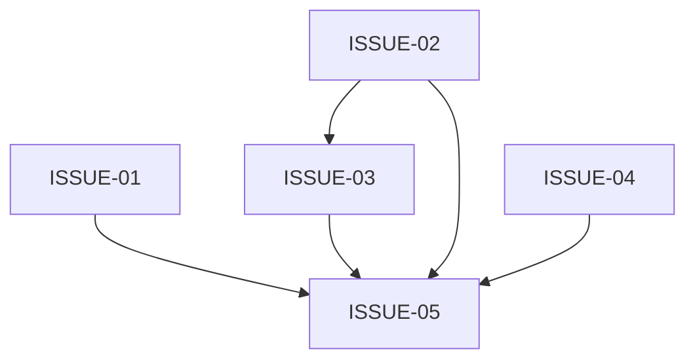

# V4.5 会话级入口与授权即开工 Spec/Issue 合同

状态：待实现；以 V4.5 设计和 PRD 为唯一当前产品合同。

## 1. 核心接口

```text
authorize_card(card_path, session_context=None) -> AuthorizationResult
```

入口可从新会话调用。运行时读取卡片绑定的 plan/revision/evidence，自动生成或恢复 plan/run/state/tasks/events，写入授权审计，并启动唯一 Monitor lease。重复调用幂等。

`remote_git_actions` 必须是 `allow | deny`；授权卡同时提供 `remote_git_actions_options=["allow", "deny"]`。未选择时状态为 `pending_user_authorization`；选择后才为 `authorized`。deny 禁止 Git 远端动作但不阻止本地 DAG 执行。

## 2. Issue

- ISSUE-01：入口 Skill 与初始化提案三态登记。
- ISSUE-02：S0/S1 入口、幂等和默认字段生成。
- ISSUE-03：候选归属、原任务恢复和递归保护。
- ISSUE-04：V4.2/V4.3/V4.4 兼容及 native_control_plane。
- ISSUE-05：授权卡 allow/deny、自动物化、自动启动 Monitor、DAG 图和回归。

## 3. DAG



I01/I02/I04 属于同一并行组；I03 仅依赖 I02；I05 等待四个节点 accepted。integration_after 不得阻塞独立节点。

## 4. 工程错误处理

plan_id、node_spec、run_id、writer、worktree、lease、cursor、provider task 和 attestation 缺失时由运行时生成、修复、重试或记录结构化 unknown；不得要求用户填写，不得要求额外启动命令，不得创建第二 writer。

## 5. 排除

deploy、发布、生产写入、凭据和外部通信不在授权卡范围内，必须保持 false/deny 且不可由 authorize 推导。
