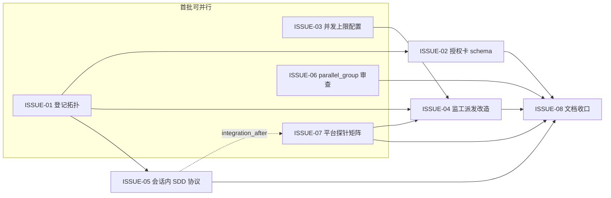

# Spec/Issue 合同：可见并行派发（visible parallel dispatch，V4.6）

状态：待用户确认（2026-09-23 起草）
上游：[2026-09-23-v46-visible-parallel-dispatch-prd.md](2026-09-23-v46-visible-parallel-dispatch-prd.md)（设计已定稿，三项用户决策全部确认）
修订对象：[2026-08-24 设计基线](2026-08-24-vibe-coding-development-guide-design.md) §任务拓扑、项目 AGENTS.md §6「developer 与 reviewer 必须是两个不同的可见独立任务」条款

## 拓扑语义总述（各 Issue 共同前提）

- 新增任务拓扑 `topology=visible-sdd`：每个 DAG 开发节点 = **一个可见 worker 会话**（Codex: `create_thread`，user-owned），会话内部跑 SDD 双角色（dev 子代理实现 + review 子代理独立只读审查），返工/复审在同一会话身份内闭环。
- 不支持会话内 SDD 的平台保留现有 `developer`/`reviewer` 双可见任务拓扑（按 PRD 平台矩阵逐平台裁定）；无可见桥接的平台降级 `background` 且必须显式披露。
- 监工只派发、等待、收口、纠偏，**永不作为任何节点的 writer**。
- 并发上限默认值 5 存于 `.vibe/config.json`（项目级配置）；授权卡只携带本次生效值快照，可为单次 run 调低、不得调高；配置变更使在途授权失效。

## ISSUE-01：任务登记拓扑字段与单会话绑定

- **文件白名单**：`vibe_guide/task_registry.py`、`tests/test_task_registry.py`
- **Intent**：`TaskBinding` 增加 `topology` 字段（`visible-sdd` | `dual-visible` | `background`，缺省按既有双任务行为=`dual-visible` 以保兼容）；`visible-sdd` 下每节点只存在一条 role=`developer` 的可见绑定（worker 会话），reviewer 不再登记为独立任务而转为会话内证据；`dual-visible` 保留现有「developer 与 reviewer 任务必须不同」校验（task_registry.py:525）；`background` 绑定必须携带 `limitations` 非空（与 PRD 披露义务对齐的登记层表达）。tasks.json 记录 `topology`，旧格式 binding 读取零迁移成本（缺省值兜底）。
- **Proof**：单测——三种 topology 的构造/持久化/回读；`visible-sdd` 下登记第二条 reviewer 任务被拒；`background` 空 limitations 被拒；旧格式（无 topology 字段）binding 文件原样可读。
- **错误行为**：未知 topology 值 → ValueError，不静默兜底。

## ISSUE-02：授权卡 schema 强化（workers 语义 + 降级披露机器校验）

- **文件白名单**：`vibe_guide/authorization.py`、`tests/test_authorization.py`、`tests/test_authorization_card_roundtrip.py`
- **Intent**：①授权卡 `workers` 字段结构化：每节点记录 `topology`、worker 会话身份来源；schema 校验拒绝任何把主会话/main session 标为 developer 的卡片（AC-05，含大小写与同义变体）；②`mode=background` 的节点必须同时在卡片中携带降级限制披露（不可见、不可直接进入、返工续接受限），缺一则 `build_authorization_card` 直接失败（AC-07）；③卡片携带并发上限快照（来源见 ISSUE-03）与拓扑摘要，digest 照旧绑定全文，配置变更自然失效。
- **Proof**：schema 校验测试——main-session developer 拒签；background 无披露拒签；披露齐全的背景卡签发/roundtrip 通过；既有 V4.5 卡片回归测试不因新字段全灭（兼容策略：新字段对旧卡为可选，仅新签发强制）。
- **错误行为**：校验失败一律 ValueError（fail-closed），不产生半有效卡片。

## ISSUE-03：项目级并发上限配置

- **文件白名单**：`vibe_guide/config.py`（新增）、`vibe_guide/initializer.py`、`tests/test_config.py`（新增）
- **Intent**：`.vibe/config.json` 增加 `max_active_worker_sessions`（整数 1–64，缺省 5）；新增 `config.py` 负责读取/校验/缺省兜底（缺文件或缺字段=默认 5，非法值=报错不兜底）；`init` 物化默认值且「存在即不改写」（沿用 prd-guide 语义）；配置变更检测（与授权卡快照比对）由 ISSUE-02 的 digest 机制自然获得，本 Issue 不另造失效逻辑。
- **Proof**：单测——缺省、显式值、非法值（0/负数/字符串/布尔）三态；init 幂等与用户改动存活；存量 fixture 项目（无该字段）行为不变。
- **错误行为**：非法值 → ValueError 并指明字段；缺失 → 默认 5 并记录来源为 default。

## ISSUE-04：监工并行派发改造（真并行载体 = 可见 worker 会话）

- **文件白名单**：`vibe_guide/monitor.py`、`vibe_guide/cli.py`、`tests/test_monitor.py`、`tests/test_native_dispatch.py`、`tests/fixtures/`（新增 2 节点 fixture DAG）
- **Intent**：①监工对 ready 集按拓扑逐节点派发：平台 `in_session_sdd=supported` → 每节点一个 `visible-sdd` 可见会话（create 携带节点契约、文件白名单、worktree/branch、SDD 协议指针）；不支持 → 现有 dev/reviewer 双任务派发；无桥 → background + 披露。②同一 tick 内尽量打满并发上限（上限 = min(授权卡快照, 项目配置)），`active_pair_limit` 语义从「活跃 dev/reviewer 对」改为「活跃 worker 会话数」，cli.py:485 的硬编码 5 改为读项目配置。③名额按「未完成且未归档的活跃会话」计算，节点 accepted 并归档后释放名额给后续 ready 节点。④监工自身 writer 路径移除/硬拒（结构保证 AC-05，而非仅靠授权卡文本）。⑤visible successor 恢复语义适配：单 writer=worker 会话（AC-08），原任务终止确认、唯一 writer、冻结 HEAD、clean state 四项证据不齐即 fail-closed。
- **Proof**：fixture 端到端——2 节点无硬依赖 DAG 同轮创建 2 条 `mode=visible`/`topology=visible-sdd` 记录且创建时间窗重叠（AC-01）；上限状态机单测（打满、释放、再打满）（AC-02）；监工作为 writer 的调用路径被拒测试（AC-05）；successor 恢复既有测试适配新语义（AC-08）。
- **错误行为**：工具丢失/状态未知 → `blocked_unknown` 沿用既有纪律；名额计算遇未知状态按占名额处理（宁可少派不多派）。

## ISSUE-05：会话内 SDD 协议与 reviewer 独立性契约

- **文件白名单**：`vibe_guide/protocols/visible-sdd-worker.md`（新增）、`tests/test_visible_sdd_contract.py`（新增）
- **Intent**：随包发布的 worker 会话协议（沿用 prd-guide/vibe-entry 的 protocols 机制）：①会话内固定流程 dev 子代理实现 → review 子代理（独立上下文、只读、非作者视角）审 → P0–P2 返工回 dev → 复审，全程同一会话身份；②review 子代理任务提示**必须显式禁止 git 写操作**（checkout/switch/reset/clean 等，知识库 2026-09-21 事故结论），跨分支查看只用 `git show`/`git diff`；③证据链要求：每轮实现/审查/返工结论写入会话交付，由监工收口进 events.jsonl；④review 子代理代改业务代码 = 违规，节点转 blocked 并记录。
- **Proof**：契约测试——协议文件在场且含四要素（双角色顺序、只读红线、git 写禁令清单、证据写回要求）（AC-03/AC-04）；协议缺失/非法名走 load_protocol 现有错误路径。
- **错误行为**：协议文件缺失 → FileNotFoundError（不新增分支）；契约要素缺失 → 测试红，不得弱化断言。

## ISSUE-06：parallel_group 派发前依赖审查

- **文件白名单**：`vibe_guide/dag.py`、`vibe_guide/planner.py`、`tests/test_dag.py`、`tests/fixtures/`（vibe-entry 01/02 回归夹具）
- **Intent**：`parallel_group` 划分/审计时强制组内依赖审查：组内任意两节点存在文件级（白名单/owned_paths 相交）或产物级（一节点契约引用另一节点产出路径）软依赖 → 审计器拒绝入组，要求改标 `integration_after` 或降级出组；审计结论写入 dag-audit（沿用 v3.10 既有审计文档形态）。
- **Proof**：单测——相交白名单拒入组、产物引用拒入组、真正无交集放行；回归夹具：vibe-entry ISSUE-01/02（02 的 AGENTS.md 块指向 01 物化的协议文件）被判为不可同组（AC-06）。
- **错误行为**：审查器自身无法判定（元数据缺失）→ 保守拒入组并记录原因，不放行。

## ISSUE-07：平台能力探针与拓扑决策矩阵

- **文件白名单**：`vibe_guide/adapters/manifests/*.yaml`（7 个）、`vibe_guide/adapters/base.py`、`vibe_guide/adapters/registry.py`、`vibe_guide/adapters/task_provider.py`、`tests/test_adapters.py`、`tests/test_agent_probe_evidence.py`
- **Intent**：①每个 manifest 增加 `in_session_sdd` 探针（fact 类，证据入能力报告，provenance 必填）；②拓扑裁决表固化进 registry：codex/claude-code/cursor/kimi-code = 会话内 SDD（PRD 已附产品文档证据）；deepseek-harness = 探针通过前按双任务独立派发，通过后升级无需改 PRD；workbuddy/grok = 双任务独立派发；③UNKNOWN 一律按「不支持」处理（能力合同 §Capability and Tool Truth），超时/空响应不得转成 UNAVAILABLE；④能力报告逐平台记录拓扑裁定与证据引用。
- **Proof**：单测——七平台 manifest 探针字段齐全且合法；裁决表与 PRD 矩阵逐行一致（防漂移断言）；UNKNOWN → 双任务/background 路径而非会话内 SDD；DeepSeek 探针 evidence 缺失时不升级。
- **错误行为**：manifest 缺探针 → 注册失败（启动即暴露）；探针证据缺失 → 拓扑=保守档，能力报告标 UNKNOWN。

## ISSUE-08：文档同步与收口

- **文件白名单**：`docs/superpowers/specs/2026-08-24-vibe-coding-development-guide-design.md`、`README.md`、`README.en.md`
- **Intent**：设计基线 §任务拓扑改写为两级拓扑（可见会话为真并行载体 + 会话内 SDD）；README 补拓扑/并发上限/降级披露说明；集成审查与全量回归。**AGENTS.md §6 条款改写**（reviewer 独立性改由会话内独立子代理保证、监工不作 writer、降级披露升级为机器校验）按 PRD 要求需同步，但属用户规则文件：本 Issue 只产出补丁建议块，由用户确认后落地，不自动改写。
- **Proof**：文档与实现一致性自检；全量 `python3 -m unittest discover -s tests -v` 绿。
- **错误行为**：AGENTS.md 补丁未经用户确认 → 不落地，交付中标注为待确认项。

## DAG

- 首批并行组：I01（task_registry）/ I03（config+initializer）/ I06（dag+planner）/ I07（adapters/*）文件白名单两两不相交。
- I02 depends_on I01（topology 枚举值是卡片 schema 输入）；I04 depends_on I01+I03+I07（绑定语义、上限来源、平台裁定三者齐备才能改派发）；I05 depends_on I01（topology=visible-sdd 命名锚定）。
- I05 → I07 为 `integration_after`：manifest 的 worker 会话 prompt 引用协议文件路径，不阻塞各自独立开发。
- I08 硬依赖全部前置（文档描述合成后的行为）。

## DAG 审计结论

- 并行组白名单逐一比对不相交：I01=task_registry，I03=config.py(新)+initializer.py，I06=dag.py+planner.py，I07=adapters/**。唯一历史共享语义点 `.vibe/config.json` 由 I03 独占写入、I02/I04 只读引用。
- monitor.py 唯一 writer = I04；cli.py 唯一 writer = I04；tests/fixtures/ 由 I04 与 I06 各建独立子目录（命名前缀 `v46-dispatch-` / `v46-parallel-audit-`），不共享文件。
- I06 与 I04 潜在语义交叉点（parallel_group 元数据消费）经 ISSUE-06 审查器输出契约隔离：I04 只消费审计结论，不改审查逻辑。
- 无环；每节点唯一 writer；integration-review 节点由 authorize 自动追加（4.1.0+ 强制）。
- 并发胃口：首批 4 个节点可同轮派发，占用 ≤4 个活跃 worker 会话名额（上限 5 内）。

## 执行方式说明

本仓库无 `.vibe`（工具源码仓，非被管项目），沿用 vibe-entry 的手动文档链（需求→决策卡→PRD→Spec→DAG→授权卡）。本次 Spec 确认后，下一步为授权卡生成与用户授权，再按本 Spec 的 DAG 派发——且本轮执行本身即 V4.6 拓扑的首次实战（每 Issue 一个可见 worker 会话，Codex `create_thread`），授权卡将按 ISSUE-02 的目标形态人工草拟、作为该 Issue 的验收样例。
