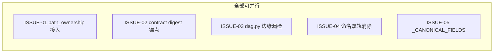

# Spec/Issue 合同：审计完整性与代码库卫生（audit integrity & hygiene，V4.7）

状态：待用户确认（2026-09-23 起草）
上游：[2026-09-23-v47-audit-integrity-hygiene-prd.md](2026-09-23-v47-audit-integrity-hygiene-prd.md)
背景来源：V4.6 run log §登记后续第 1–5 条（Feynman P3-1、I04 R2/R4 P3、Russell P3、Dirac P3、I01 交付证据噪声项）

## 总体前提

本迭代五个 Issue 文件白名单两两不相交，首批可全部并行派发。无新功能，只补齐 V4.6 留下的五个机制空洞。所有改动均在已有抽象内完成，不引入新模块或新抽象层。

---

## ISSUE-01：path_ownership 接入派发路径

- **文件白名单**：`vibe_guide/monitor.py`、`vibe_guide/path_ownership.py`、`tests/test_monitor.py`
- **Intent**：`_schedule_ready` 在派发 ready 集之前，对本轮所有候选节点的 `owned_paths` 调用已有的 `validate_path_ownership(nodes)`；发现冲突（`PathOwnershipResult.valid == False`）时拒绝整轮派发，将冲突节点及冲突路径写入 dag-audit（沿用既有 `dag-audit` 文档形态），节点状态设为 `blocked_unknown` 并记录原因；无冲突时正常派发。检查范围覆盖同组（parallel_group 内）、跨组和无组的所有候选节点，不仅限于有 parallel_group 标记的节点。`path_ownership.py` 本身不改动——函数已正确实现，只是没有被调用。
- **Proof**：单测——两节点 owned_paths 相交 → `_schedule_ready` 拒绝并写 audit 记录（断言 dag-audit 包含冲突路径和节点 id）；两节点 owned_paths 不相交 → 正常放行；三节点其中一对相交 → 拒绝全部（宁可保守）；节点 owned_paths 为空列表 → 当作无拥有路径，不阻塞；跨组与无组情况各一个用例。回归：现有 `test_monitor.py` 全绿。
- **错误行为**：`validate_path_ownership` 返回 `missing_nodes` 非空时（节点缺少 `owned_paths`/`read_paths` 属性）按冲突处理——宁可阻塞不派发。

---

## ISSUE-02：accepted 事件 evidence_ref 绑 contract digest

- **文件白名单**：`vibe_guide/binding_lifecycle.py`、`vibe_guide/monitor.py`、`tests/test_visible_sdd_contract.py`
- **Intent**：①`binding_lifecycle.py` 的 `VisibleSddAcceptance`（或等价的 accepted 事件数据结构）新增字段 `contract_digest: str`，值为当前节点 contract 内容的 SHA-256 前 32 字符（hex）；accepted 事件写入时必须携带该字段，缺失则写入失败（fail-closed）。②accepted 事件校验器（监工收口路径）读取时比对：从 tasks.json 或 events.jsonl 里的 contract 内容重新计算 digest，与事件携带值比对，不一致则该 accepted 事件视为无效，节点保持待审状态而非错误地转为 accepted。③visible_sdd_contract 的 protocol 常量比对：现有测试套件中 `test_visible_sdd_contract.py` 已有协议要素断言，增加一个用例：accepted 事件里的 `protocol_ref` 字段与 `VISIBLE_SDD_PROTOCOL_REF` 常量一致性断言（防止协议文件改路径后 accepted 事件静默指向旧路径）。
- **Proof**：单测——contract_digest 正确 → 校验通过；contract_digest 缺失 → 写入失败；contract_digest 不匹配（contract 被篡改）→ 校验拒绝；`protocol_ref` 与常量不一致 → 测试红。回归：现有 `test_visible_sdd_contract.py` 全绿。
- **错误行为**：contract 内容不可读（空或 None）→ 拒绝生成 accepted 事件，节点进 `blocked_unknown`；不得产生空 digest 或占位符 digest。

---

## ISSUE-03：dag.py 两处边缘漏检修补

- **文件白名单**：`vibe_guide/dag.py`、`tests/test_dag.py`
- **Intent**：①根目录相交专项覆盖：`normalize_project_path` 已正确拒绝 `.`（path_ownership.py:15），dag.py 的 parallel_group 相交判断依赖 normalize_project_path，所以 `.` 进不了 owned_paths。本 Issue 的工作是补两个单测，明确断言：传入含 `.` 的路径给 `normalize_project_path` → 抛 ValueError；dag.py parallel_group 审计在节点 owned_paths 包含根级宽泛路径（如单字符目录名 `a`，与另一节点 `a/b` 形成前缀相交）时行为正确——若当前逻辑对前缀相交（父目录 owns，子路径也被 own）没有检测，补上该检测逻辑。②CJK 粘连路径引用检测：dag.py 的产物路径引用检测用于判断一个节点的 contract 是否引用了另一节点的输出路径；当路径含 CJK 字符且前后无空格（如 `测试输出.json`）时，当前基于空白分词的提取会漏检。修复：在路径引用提取正则里增加对非 ASCII 文件名的支持——路径分隔符 `/` 和文件扩展名 `.xxx` 已足够定界，不依赖空格。
- **Proof**：单测——`normalize_project_path(".")` → ValueError；父目录前缀相交用例（`src` 与 `src/utils.py`）→ 相交被检出；CJK 文件名 `测试输出.json` 出现在 contract 文本中 → 引用检出；纯 ASCII 现有路径用例回归全绿。
- **错误行为**：路径引用提取无法确定时保守返回空集（不报假阳性），不因 CJK 字符抛异常。

---

## ISSUE-04：命名双轨消除——设计文档与代码注释对齐

- **文件白名单**：`docs/superpowers/specs/2026-08-24-vibe-coding-development-guide-design.md`、`README.md`、`README.en.md`
- **Intent**：两个名字各有正确的使用场景，不合并：`in_session_sdd` 是 manifest 探针字段名（描述平台能力，属于适配层），`visible-sdd` 是 topology 枚举值（属于派发层）；混用时读者无法判断在哪一层操作。修改内容：①设计基线 §7.3（或含"任务对"的对应段落）将"任务对"全部替换为"worker 会话"，补充两个名字的使用场景说明（一句话：`in_session_sdd` = manifest 能力探针；`visible-sdd` = topology 枚举值，二者语义不同，不互换）。②README.md 和 README.en.md 中出现"任务对"或混用的段落同步修正。③`vibe_guide/monitor.py` 中若有注释将 `in_session_sdd` 当作 topology 枚举值引用（而非能力探针常量引用），修正注释措辞——代码逻辑本身不动。
- **Proof**：grep 验证——`docs/superpowers/specs/2026-08-24-vibe-coding-development-guide-design.md` 中不再出现"任务对"；monitor.py 中 `_RULING_IN_SESSION_SDD` 的注释正确描述为"能力探针字段名"；README 关键词检查（全量回归与此 Issue 无交集，文档改动不影响测试）。
- **错误行为**：不改任何 Python 逻辑，只改文档和注释；若发现"任务对"还出现在其他文档，一并替换（在白名单文件内）。

---

## ISSUE-05：_CANONICAL_FIELDS 补齐 topology

- **文件白名单**：`vibe_guide/lifecycle.py`、`tests/test_lifecycle.py`
- **Intent**：`lifecycle.py:35` 的 `_CANONICAL_FIELDS` 集合增加 `"topology"`。`migrate_task_record` 在遇到未知字段时会把它推入 `legacy` 字典（第 76-77 行），导致带 `topology` 的任务记录每次 migrate 都把 topology 值埋进 legacy 而不是保留在顶层。加入 `_CANONICAL_FIELDS` 后，topology 字段在 migrate 中被顶层保留，与 threadId、branch、worktree 等字段同等对待。
- **Proof**：单测——含 `topology: "visible-sdd"` 的任务记录经 `migrate_task_record` 后，顶层保留 `topology` 字段，`legacy` 字典中不出现 `topology`；不含 `topology` 的旧格式记录 migrate 结果不变（回归）；全量 `python3 -m unittest discover -s tests -v` 绿。
- **错误行为**：topology 值非法（不在 `_TOPOLOGIES` 枚举内）由 task_registry.py 的 TaskBinding 校验处理，lifecycle.py 只负责字段保留，不做值校验。

---

## DAG

- 五个 Issue 文件白名单两两不相交：I01=monitor.py+path_ownership.py+test_monitor.py；I02=binding_lifecycle.py+monitor.py（注：I01 也改 monitor.py，见下方冲突分析）；I03=dag.py+test_dag.py；I04=docs/设计基线+README；I05=lifecycle.py+test_lifecycle.py。
- **I01 与 I02 共享 monitor.py**：I01 改 `_schedule_ready`（派发前检查），I02 改 accepted 事件写入路径（`_replay_visible_sdd_acceptance` 及 accepted 事件校验）——两者在 monitor.py 内操作的代码段不相交，但有共同 writer 风险。处置：标为 `integration_after`，I02 等 I01 合并后再派发，或两 worker 在授权卡中明确约定各自的 monitor.py 行号范围互不触碰。**推荐方案：I01 先合并，I02 随后**，保持干净的 diff 序列。
- I03/I04/I05 与其余全部无共享文件，可与 I01 同轮派发，I02 晚一波。

## DAG 审计结论

- I01 vs I02 存在 monitor.py 软依赖（共享文件），已标注处置方案；其余四对无交集。
- 并发胃口：首批 4 个节点（I01/I03/I04/I05）同轮派发，I02 在 I01 合并后放行——总活跃会话峰值 ≤4，默认上限 5 内。
- 无环；I02 depends_on I01（monitor.py 顺序依赖）。
