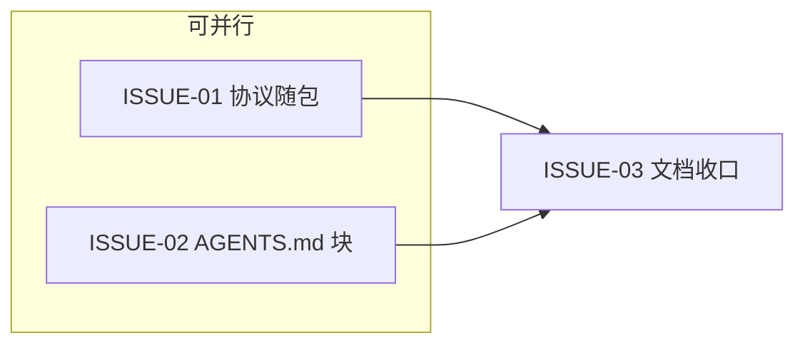

# Spec/Issue 合同：新会话 S0/S1 入口接线（vibe-entry）

状态：待开发计划确认（2026-09-23）
上游：2026-09-23-vibe-entry-skill-decision-card.md（已确认）+ 2026-09-23-vibe-entry-skill-prd.md

## ISSUE-01：vibe-entry 协议随包发布与物化

- **文件白名单**：`vibe_guide/protocols/vibe-entry.md`（新增）、`vibe_guide/protocols/__init__.py`、`vibe_guide/initializer.py`、`tests/test_vibe_entry_protocol.py`（新增）
- **Intent**：自包含入口协议（S0 白名单要旨 / planner 五维速查表 / 阈值 ≤8·9-15·>15 / 动态升级 / >15 时的 scan+plan 指令 / 会话门纪律 / 短提示 / complex-task-methodology 仅可选指针）；init 物化为 `.vibe/proposals/skills/vibe-entry/SKILL.md`，沿用 prd-guide 的「存在即不改写」语义
- **Proof**：契约测试（五维表+阈值在场、无外部技能硬依赖措辞）；物化幂等与用户改动存活测试；prd-guide 回归测试不动
- **错误行为**：协议文件缺失/非法名 → load_protocol 现有 FileNotFoundError/ValueError 路径，不新增分支

## ISSUE-02：AGENTS.md「新会话入口」提案块

- **文件白名单**：`vibe_guide/scanner.py`、`tests/test_scanner.py`（或现有 agentsmd 提案测试文件，以现状为准）
- **Intent**：新增 `VIBE_ENTRY_RULES` 块（marker 与标题一致），追加进 `AGENTSMD_BLOCKS` 末尾（文档序在既有两块之后），`missing_agentsmd_blocks` 按 marker 独立检测；三态提案机制（proposal / pending-update / offered-sections）零改动复用
- **块内容上限**：4 条以内——① 开发/改动类请求先按 `.vibe/proposals/skills/vibe-entry/SKILL.md` 自评；② >15 或拿不准才 `vibe scan` + `vibe plan --request --s1`；③ ≤15 直接执行/轻规划不触碰 vibe；④ 会话门阻塞停下报告不得跳过
- **Proof**：缺失检测、全新项目进 proposal.md、已评审项目进 pending-update、reviewer 删除后重 init 不复活、apply-agentsmd 合入幂等；既有两块检测零回归

## ISSUE-03：文档与收口

- **文件白名单**：`README.md`、`README.en.md`
- **Intent**：README 命令表补入口说明（新会话入口 = SKILL.md 自评 + 复杂才进 vibe）；集成审查与全量回归
- **Proof**：文档与实现一致性自检；全量测试绿

## DAG

- I01/I02 无共享文件（protocols/initializer vs scanner），同一 parallel_group
- I03 `integration_after` I01/I02（文档描述两者合成后的行为），不阻塞独立开发
- 无环；唯一 writer 每节点；integration-review 节点由 authorize 自动追加（4.1.0+ 强制）

## DAG 审计结论

I01/I02 文件白名单不相交（逐一比对），可并行成立；I03 只改两个 README，硬依赖两者内容定稿。风险点：I01 触碰 initializer.py——与 I02 的 scanner.py 无交集；`AGENTSMD_BLOCKS` 元组追加是唯一共享语义点（在 scanner.py，归 I02）。

## 执行方式说明

本仓库无 `.vibe`（工具源码仓，非被管项目），本次走手动文档链（需求→决策卡→PRD→Spec→DAG→授权卡），与本仓既有 V4.5 各阶段的文档实践一致；不为此单独 init 本仓库。
